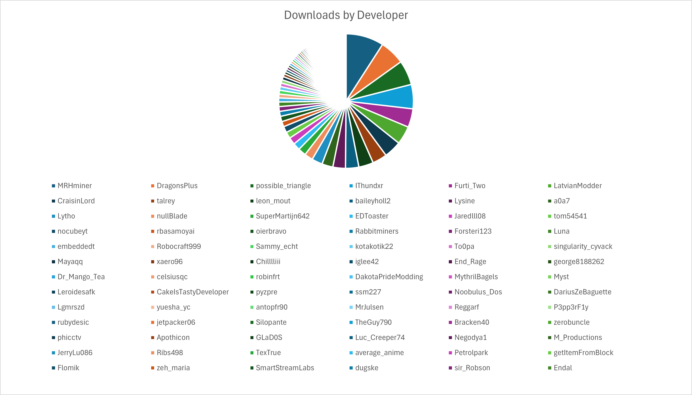

# Introduction

Good day, and welcome to my boredom project.

This is a collection of data and analysis of the Create mod's ecosystem, specifically anything that has Create, or Create Fabric listed as a dependency on Curseforge.

The data is sourced from Curseforge (collected 09/06/2025), and is intended to be a snapshot of the current state of Create's modding community.

## 25% of downloads are attributed to just 5 mods

The 3 mods are: **Crafts and Additions, Steam and Rails, Slice 'n' Dice**. The other two are compat mods: **Create Kube.JS** and **Iris & Oculus support**.

Here is a clearer list of a top section of mods:

## 25% of downloads are attributed to just 3 authors

The big 3: **MRHminer** (1 mod), **possible_triangle** (2 mods), **IThundxr** (3 mods).

Top ~50 authors (total download count):

I'm **44th** :)

## DragonsPlus is the number one author by download performance!

Here is now the authors, but associated with their rates of download rather than accumulated downloads:

Here again you can see there is actually quite a large gap between **DragonsPlus** and the next highest modder (**IThundxr**).

Clearly a much better metric, as **I'm 22nd**.

This is where **I crown the members of DragonsPlus the monarchs of Create modding**, since this is probably the best metric cause of its measure of performance rather than just total downloads.

### Also, who the hell is robinfrt!?

No clue, but they own **16 (16!!) mods**:

- Create: Deep Dark [Forge/NeoForge]
- Create: Rustic Structures [Forge/Fabric/NeoForge]
- Create: Curios Jetpack & Backtank [Forge/Fabric/NeoForge]
- Create: Cheese Factory [Forge/NeoForge]
- Create: Peaceful [Forge/Fabric/NeoForge]
- Create: Ranged [Forge/Fabric/NeoForge]
- Create: Simple Ore Doubling [Forge/Fabric/NeoForge]
- Create: Easy Stone Generators [Forge/Fabric/NeoForge]
- Create: Copper & Zinc [Forge/Fabric/NeoForge]
- Create: Ultimate Factory [Datapack]
- Create: Copper & Zinc [Datapack]
- Create: Enlightend [Forge/NeoForge]
- Create: Ultimate Factory [Forge/Fabric/NeoForge]
- Create: Ironworks [Forge/Fabric/NeoForge]
- Create: Crafts & (More) Additions [Forge/Fabric]
- Create: Winery [Forge/NeoForge]

Wow, **what a guy!**

## Mods by download rates

Quite similar to the mods by total download counts, but it is a bit more even, also clearly shows **Steam 'n' Rails** and **Crafts and Additions** to be the **2 main downloaded mods**.

## Mods by download performance against their actual download counts

While there are many breakthroughs, few of the highest performing mods are new (where they perform better in comparison to their downloads), which is to be expected since as the way I see it, the **'promotion loop'** forms a significant portion of downloads for these mods (where more downloaded mods show up higher in listings and are in turn downloaded more), rather than just the contributions from modpack inclusions.

In other words, **people prefer to download mods that are already popular and that they know**, because these are most likely the ones they've played with before.

## Conclusions

I'm going to **lock in and produce the coolest mod ever**—just you wait, **I'm going to be NUMBER ONE**.

In all seriousness, this data is very interesting, and I hope to see how this may change over time (if I remember to update this page).

## Note on Biases

Because all of this data is sourced from Curseforge there are some important biases to note:

- Mods that are included in modpacks are significantly more downloaded.
- More technical mods (such as **my own, pattern schematics**) perform worse than more general mods (**like trading floor**) on Modrinth rather than Curseforge.
- Some mods might be missing. Of the massive sample I was able to collect, it's likely that some mods were missing a dependency on **Create** and therefore weren't counted.

# Data Spreadsheet

Available here on **[Google Sheets](https://docs.google.com/spreadsheets/d/1LioDgjSDE3QhZP1XjE8diui8SueDdx2Em7WNZxLupT4/edit?usp=sharing)**.

This has **633 mods** collected from Curseforge, with their download counts, authors, and other data compiled into this (excluding charts which were made in a separate Excel sheet).

See the **[GitHub repository](https://github.com/cakeGit/The-State-of-Create-Addons)** for the code used to collect this data.

---

Made by **[cakeGit](https://github.com/cakeGit)** with ❤️ and boredom.