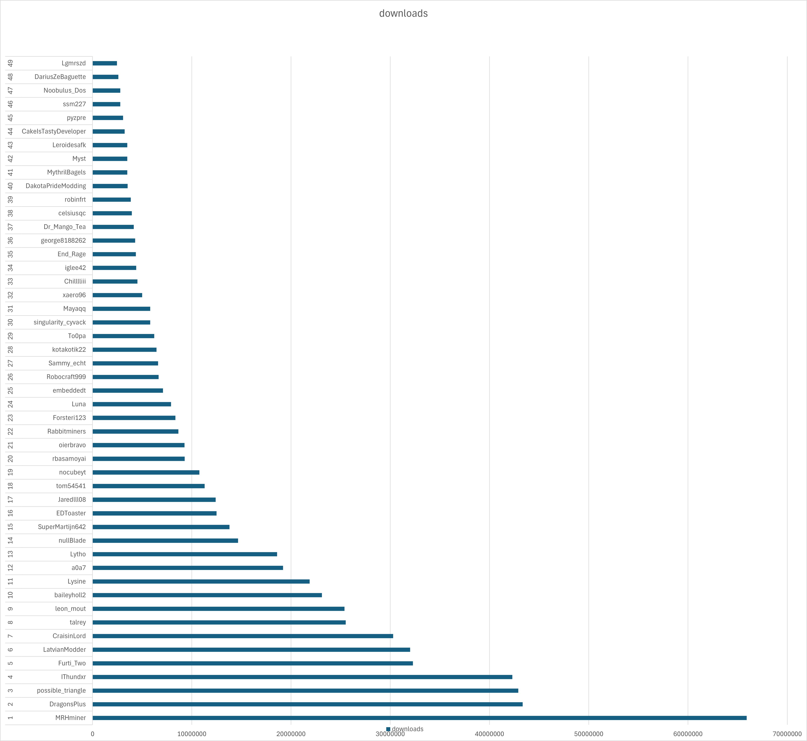

# (Curseforge) The state of create mods

## 25% of downloads are attributed to just 5 mods

The 3 mods are: Crafts and additions, Steam and rails, Slice 'n' Dice. The other two are compat mods: Create Kube.JS, and Iris & Oculus support.

Here is a clearer list of a top section of mods:

## 25% of downloads are attributed to just 3 authors

The big 3: MRHminer (1 mod), possible_triangle (2 mods), IThundxr (3 mods).

Top ~50 authors (total download count):

I'm 44th :)

## DragonsPlus is the number one modder by download performance!

Here is now the authors, but associated with their rates of download rather than accumulated downloads:

Here again you can see there is actually quite a large gap between DragonsPlus and the next highest modder (IThundxr)

### Who the hell is robinfrt!?

No clue, but they own 16 (16!!) mods:
- Create: Deep Dark [Forge/NeoForge]
- Create: Rustic Structures [Forge/Fabric/NeoForge]
- Create: Curios Jetpack & Backtank [Forge/Fabric/NeoForge]
- Create: Cheese Factory [Forge/NeoForge]
- Create: Peaceful [Forge/Fabric/NeoForge]
- Create: Ranged [Forge/Fabric/NeoForge]
- Create: Simple Ore Doubling [Forge/Fabric/NeoForge]
- Create: Easy Stone Generators [Forge/Fabric/NeoForge]
- Create: Copper & Zinc [Forge/Fabric/NeoForge]
- Create: Ultimate Factory [Datapack]
- Create: Copper & Zinc [Datapack]
- Create: Enlightend [Forge/NeoForge]
- Create: Ultimate Factory [Forge/Fabric/NeoForge]
- Create: Ironworks [Forge/Fabric/NeoForge]
- Create: Crafts & (More) Additions [Forge/Fabric]
- Create: Winery [Forge/NeoForge]
Wow, what a guy!

## Mods by download rates

Quite similar to the mods by total download counts, but it is a bit more even, also clearly shows Steam 'n' Rails and Crafts and Additions to be the 2 main downloaded mods.

## Mods by download performance against their actual download counts

While there are many breakthroughs, few of the highest performing mods are new, which is to be expected since as the way I see it, the 'promotion loop' forms a significant portion of downloads for these mods (where more downloaded mods show up higher in listings and are in turn downloaded more), rather than just the contributions from modpack inclusions.

## Conclusions

I'm going to lock in and produce the coolest mod ever just you wait im going to be NUMBER ONE.  

## Biases

Because all of this data is sourced from Curseforge there are some important biases to note:

- Mods that are included in modpacks are significantly more downloaded
- More technical mods (such as my own, pattern schematics) perform worse than more general mods (like trading floor) on modrinth rather than curseforge
- Some mods might be missing, of the massive sample I was able to collect, it's likley that some mods were missing a dependency on create and therefore weren't counted

# Data Spreadsheet
[Google docs spreadsheet](https://docs.google.com/spreadsheets/d/1LioDgjSDE3QhZP1XjE8diui8SueDdx2Em7WNZxLupT4/edit?usp=sharing)